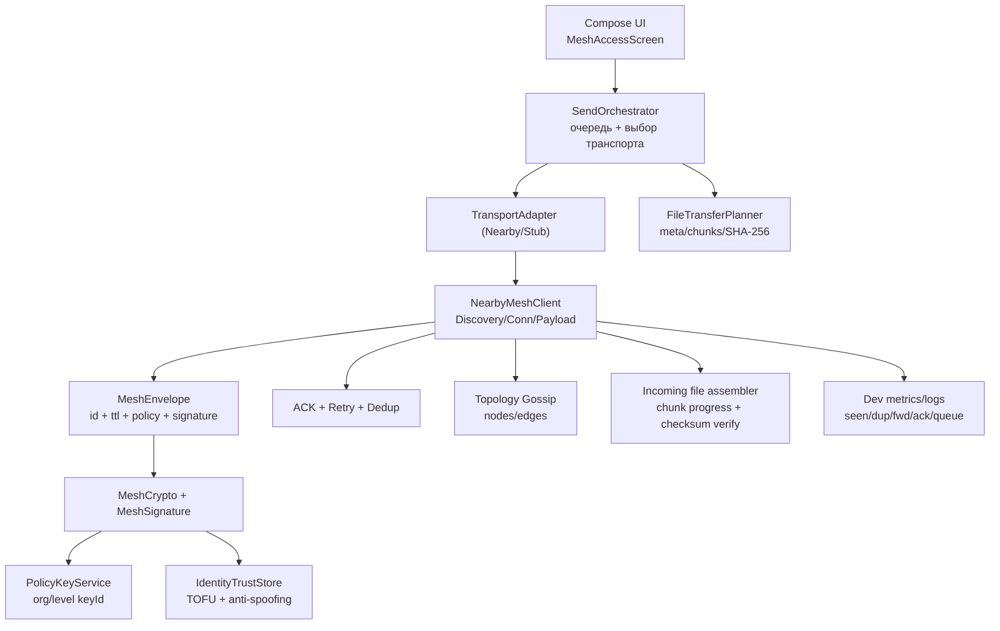

# Архитектурная схема

## Поведение при разрывах

- при потере соединения endpoint удаляется из active set;
- неподтверждённые сообщения остаются в очереди;
- retry отправки продолжается, пока не достигнут лимит;
- после восстановления соединения `flushAll()` дозапускает pending очередь.

## Маршрутизация и мультихоп

- каждое сообщение имеет `ttl` и `hopCount`;
- ретрансляция идёт всем peers, кроме источника текущего шага;
- `seenMessageIds` блокирует дубли и петли.
